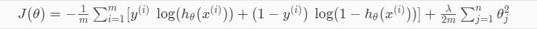

> 最近在看Andrew Ng的机器学习视频，因此记录一下学习笔记。对于本课程我总结了几个比较关键的点， 他们分别是逻辑回归、正则化、梯度下降、反向传播、SVM和PCA。

# 1 逻辑回归(Logistic Regression)

其实本质上，我觉得和线性回归是一致的，套用了一个激活函数。形式上大概就是 **sigmoid(线性回归)=逻辑回归**。因为借助了sigmoid的映射关系，可以对数据降敏，排除极端值的影响，对结果定性。但是受限于使用场景，**非线形分布**的事务决策结果也不理想。

二分类和多分类：

# 2 梯度下降

梯度下降，首先究其本质，梯度下降本身离不开损失函数，损失函数就是样本初始值经过模型预测得到一个预测值，预测值和真实值之间的差距就是损失函数，究其本质就是**计算预测值和真实值差距的一类函数泛指**，例举L1Loss和CrossEntropyLoss

 CrossEntropyLoss被应用于逻辑回归中，同上一节。

很多对梯度下降的解说都会用山谷来形容，通过一个加速度和方向（二维的话，方向单一，所以不做考虑），让小球在一个空间内（一般是三维）移动，触及最低点

     

贴两张经典动图，当然这里是放了一些optimizer的比较，但是从这个轨迹可以窥见梯度下降的过程。

## 2.1 Gradient Descent Optimization

梯度下降的优化集中在学习率和加速度上，根据我之前学习的映像，本质都是要解决**加速度过小冲到山谷耗时长**、**加速度过小冲不出局部最优解**和**加速度过大始终没法定位到山谷**的三个核心点。主要的几个算法如下。课程里面没有怎么讲这部分，这部分内容开一个新blog写。

# 3 正则化

正则化在Andrew课程里面讲的不深，正则化的出现，是因为过拟合的问题。**在早期用多项式函数去拟合训练样本的时候，多分的贴合训练数据会导致loss function趋近于0，这会导致拟合曲线没有泛用性**，因此我们设置一些去敏的策略：

1. 缩减变量的个数：舍弃一些变量，保留更为重要的信息，但是基于这种策略下，势必会造成一些信息的缺失。
2. 正则化：**保留所有的变量，将一些不重要的特征的权值置为0或权值变小使得特征的参数矩阵变得稀疏，使每一个变量都对预测产生一点影响。**

关于正则化，我参考了[正则化(regularization)总结](https://zhuanlan.zhihu.com/p/128129015)以及[L1、L2正则化总结](https://blog.csdn.net/Yasin0/article/details/89682616)，常见的正则化方法有lasso回归（l1），岭回归（l2）。

通过添加正则项，可以使模型的部分参数值都较小甚至趋于0，对应的特征对模型的影响就比较小，相当于对无关特征做了一个惩罚，即使它们的值波动比较大，受限于参数值很小，也不会对模型的输出结果造成太大影响。简而言之，**正则化是将模型参数加入到损失函数中，能避免权值过大，模型过于陡峭**，从而降低过拟合。

关于l1和l2的比较，一般常见的是对解空间进行对比。如上图所示，

# 4 反向传播

关于backpropagation 我认为目前就是这几个算法中的核心算法，也是损失函数能对神经网络起作用的本质原因，神经网络通过正向传播得到Loss值，。我例举了上述的优化方程，来梳理一下backpropagation 的优化原理。

但在此先引入链式法则。

## 4.1 链式法则

上例场景，一辆汽车20万，购置两辆，到达一节点。购买需支付购置税1.1，到达二节点，共计44万。

那么在这里，汽车的单价对最终结果的影响导数就是：

1. 44/44 = 1
2. 44/40 = 1.1
3. 40/20 = 2

 44/44 * 44/40 * 40/20 = 2.2。同理，购买数量对最终结果的影响导数是 44/44 * 44/40 * 40/2 = 22

> 如果某个函数由复合函数表示，则该复合函数的导数可以用构成复合函数的各个函数的导数的乘积表示。

回到反向传播。我们聚焦于乘法节点。

很容易知道z对x求导就是y，z对y求导就是x，所以在反向传播的时候，输入值的交叉相乘流入下一个节点。

当然神经网络中还存在加法节点，仿射变换，ReLU层和Softmax层等等，其中的反向传播对应效果不尽相同。

加法节点的反向传播导数均是0，仿射变换类似乘法节点, ReLU比较特殊一点，当x>0时， y=x，求导为1，也就是原封不动传递值。当x<0时，y=0，求导为0，也就是传递值为0。

## 4.2 参数更新

基于上述描述的链式法则，我们需要更新的参数对象就是wight和bias，即神经网络中真正起到作用的两个参数数据，根据乘法法则，dw的乘法的另一个输入值，db就是原本输入值。

第二步，如何去更新weight和bias。如果从最基本的无脑递减W = W - dW，b = b - db，效果可能并不太好，我们需要引入上述两个概念，**正则化惩罚项**和**学习率**。

正如本节开头所示的公式结尾 1/2W^2，正则化惩罚项的作用是防止模型过拟合，筛选出有效特征。1/2W^2是为了衡量分散度所设定的项，对1/2W^2求导就是W。修正后dW = dW + reg*W (reg是系数)。

另一方面，为了降低从峰到谷的过程中跨步过大导致迟迟不能收敛的情况，我们设置小的学习率epsilon来避免错过梯度下降中的谷值，参考梯度下降。

因此最终更新后的W和b写作：

W = W - epsilon*dW

b = b - epsilon*db

至此，一次反向传播的流程就走完了。

# SVM

SVM支持向量机，早期的经典无监督分类算法。使用超平面将空间中的元素分类了，上图展示了在二位平面中的分类情形。该算法当然也可以应用在高维度空间中，通过映射将低空间中的元素分层，在高空间种用平面分类。

而低空间如何将元素映射到高维空间就是我们需要关注的点，这里我们引入[核函数概念](https://blog.csdn.net/qq_42363032/article/details/107210881)。

简单地说，核函数是计算两个向量在隐式映射后空间中的内积的函数。核函数通过先对特征向量做内积，然后用函数 K 进行变换，这有利于避开直接在高维空间中计算，大大简化问题求解。并且这等价于先对向量做核映射然后再做内积。

高斯核函数，可根据实际需要灵活选取参数σ，甚至还可以将原始维度空间映射到无穷维度空间。不过，如果σ取值很大，会导致高次特征上的权重衰减快；如果σ取值很小，其好处是可以将任意的数据映射成为线性可分，但容易造成过拟合现象。

# PCA

不同于SVM的变换维度，PCA的核心思想是变换坐标系，

举个例子，如上图所示，假如横纵坐标表示了西瓜的质量和颜色深度，我们并不需分别通过两种属性来对西瓜做判断，我们通过PCA做一个特征组合，也就是在红线最终定格处，重新指定坐标系，测定出新的横纵坐标，借此作出新的组合特性。

关于新的坐标轴如何生成，我看到很经典的解释。

> 顺便，你可以把黑线想象成硬质杆，然后把红线想象成弹簧。弹簧的势能和它的长度平方成正比（物理学上这称为[胡克定律](https://www.zhihu.com/search?q=胡克定律&search_source=Entity&hybrid_search_source=Entity&hybrid_search_extra={"sourceType"%3A"answer"%2C"sourceId"%3A474222214})），所以杆将调整自己的朝向以最小化这些平方距离的总和。我做了一个关于它大概是什么样的模拟，加上了一点摩擦力。

结。
