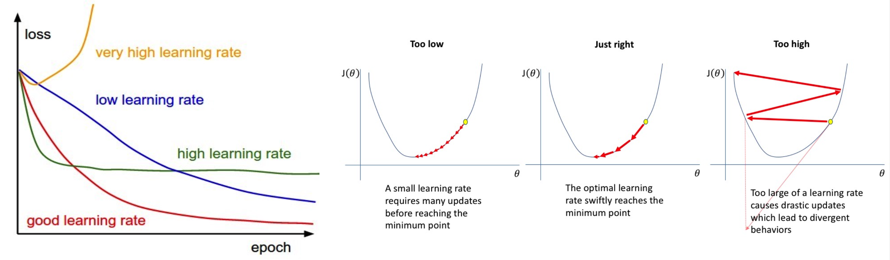
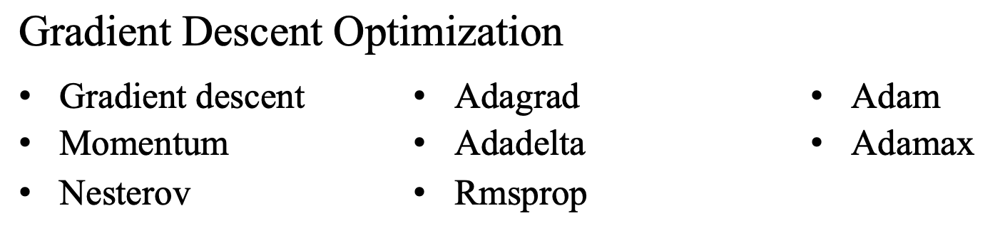

> 最近在看Andrew Ng的机器学习视频，因此记录一下学习笔记。对于本课程我总结了几个比较关键的点， 他们分别是逻辑回归、正则化、梯度下降、反向传播、SVM和PCA。

# 逻辑回归(Logistic Regression)

其实本质上，我觉得和线性回归是一致的，套用了一个激活函数。形式上大概就是 **sigmoid(线性回归)=逻辑回归**。因为借助了sigmoid的映射关系，可以对数据降敏，排除极端值的影响，对结果定性。但是受限于使用场景，**非线形分布**的事务决策结果也不理想。

二分类和多分类：
$$
P\left(\mathbf{x}_{i}\right)=\operatorname{sigmoid}\left(\mathbf{x}_{i} \mathbf{w}\right)=g\left(\mathbf{x}_{i} \mathbf{w}\right)=\frac{1}{1+e^{-\mathbf{x}_{i} \mathbf{w}}}
$$

$$
p(\mathbf{Y} \mid \mathbf{X}, \mathbf{w})=\prod_{i=1}^{m} p\left(y_{i} \mid \mathbf{x}_{i}, \mathbf{w}\right)
$$

# 梯度下降

梯度下降，首先究其本质，梯度下降本身离不开损失函数，

## Gradient Descent Optimization

梯度下降的优化集中在学习率和加速度上，主要的几个算法如下。课程里面没有怎么讲这部分，这部分内容开一个新blog写。

# 正则化

正则化课程里面讲的不深，正则化的本质，那就

# 反向传播

# SVM

# PCA
